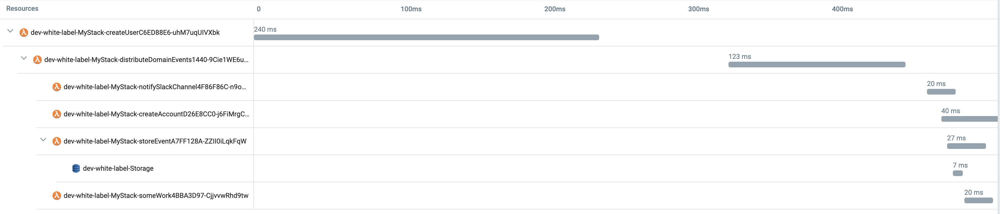

# Serverless Domain-Driven Design (DDD) with unit tests

Domain Events are a fundamental building block in DDD, if you want to indicate an event that is significant to your app, raise this event and let other modules of your app subscribe and react to it.

This project exemplifies a `CreateUser` use case and how we can trigger an event, signaling we have a new user onboard.

Domain events (e.g. [UserCreatedEvent](src/modules/users/domain/events/UserCreatedEvent.ts)) are dispatched after the aggregates ([User](src/modules/users/domain/User.ts)) changes are persisted in the database. We can subscribe to it from the same module ([SomeWork](src/modules/users/useCases/someWork/SomeWork.ts)) or a different one ([StoreEvent](src/modules/audit/useCases/storeEvent/StoreEvent.ts), [NotifySlackChannel](src/modules/notification/useCases/notifySlackChannel/NotifySlackChannel.ts), [CreateAccount](src/modules/accounts/useCases/createAccount/CreateAccount.ts)).

Communication in the same module is given as an example but using domain events for intra-module/app communication inside a same domain model may involve adding an indirection that doesn't add value and a direct/explicit flow is more convenient.

The lambda entry point for `CreateUser` use case is [src/modules/users/useCases/createUser/index.ts](src/modules/users/useCases/createUser/index.ts), there we:
* Create [CreateUser](src/modules/users/useCases/createUser/CreateUser.ts) controller
* In `CreateUser.constructor` we register `UserCreatedEvent` to an intermediate lambda [DistributeDomainEvents](src/shared/infra/invocation/DistributeDomainEvents.ts) that will invoke all its subscribers (`StoreEvent`, `CreateAccount`, `NotifySlackChannel` and `SomeWork` lambdas).

This is the transaction tracing from [Lumigo](https://lumigo.io):

<br />
<p align="center">
    
</p>
<br />

## Timelines

If it's been some time since last request, we get cold starts and the execution of `createUser` takes ~1,2s, while all the invoked lambdas (`distributeDomainEvents`, `createAccount`, `notifySlackChannel`, `storeEvent` and `someWrok`) take an extra ~2,1s, so the whole distributed transaction takes ~3,3s:

<br />
<p align="center">
    
</p>
<br />

If we repeat a request in the next 5m, we don't have cold starts, `createUser` takes 240ms, all the invoked lambdas an extra ~280ms, so the whole distributed transaction takes ~520ms:

<br />
<p align="center">
    
</p>
<br />

## Event modeling

<br />
<p align="center">
    
</p>
<br />

## Decorators

For cross-cutting concerns these decorators are used:
* [ReturnUnexpectedError](src/shared/decorators/ReturnUnexpectedError.ts): When we receive a FE client request and the server throws an unexpected error, we log the error, request and context; and return a well-formed error response to the FE client. Use cases: [CreateUser](src/modules/users/useCases/createUser/index.ts), [GetAccountByUserID](src/modules/accounts/useCases/getAccountByUserId/index.ts), [CreateTransaction](src/modules/accounts/useCases/createTransaction/index.ts) and [Transfer](src/modules/accounts/useCases/transfer/index.ts)
* [Transaction](src/shared/decorators/Transaction.ts): All command use cases that use the SQL DB should be wrapped in a serializable transaction (for query use cases don't). Use cases: [CreateUser](src/modules/users/useCases/createUser/index.ts), [CreateAccount](src/modules/accounts/useCases/createAccount/index.ts), [CreateTransaction](src/modules/accounts/useCases/createTransaction/index.ts) and [Transfer](src/modules/accounts/useCases/transfer/index.ts)
* [DBretry](src/shared/decorators/DBretry.ts): Handle retries for DB/Sequelize connection failures. Use cases: [CreateUser](src/modules/users/useCases/createUser/index.ts), [CreateAccount](src/modules/accounts/useCases/createAccount/index.ts), [GetAccountByUserID](src/modules/accounts/useCases/getAccountByUserId/index.ts), [CreateTransaction](src/modules/accounts/useCases/createTransaction/index.ts) and [Transfer](src/modules/accounts/useCases/transfer/index.ts)
* Cache is query specific: [GetAccountByUserIdCache](src/modules/accounts/useCases/getAccountByUserId/GetAccountByUserIdCache.ts)

## Tests

Unit tests (with faked repos):

- Value Objects: 
    - Users: [UserName](src/modules/users/domain/UserEmail.unit.ts), [UserEmail](src/modules/users/domain/UserEmail.unit.ts), [UserPassword](src/modules/users/domain/UserPassword.unit.ts), [Alias](src/modules/users/domain/Alias.unit.ts)
    - Accounts: [Amount](src/modules/accounts/domain/Amount.unit.ts), [Description](src/modules/accounts/domain/Description.unit.ts)
- Aggregates:
    - Users: [User](src/modules/users/domain/User.unit.ts)
    - Accounts: [Account](src/modules/accounts/domain/Account.ts) (with internal entity [Transaction](src/modules/accounts/domain/Transaction.unit.ts))
- Services:
    - Accounts: [AccountService](src/modules/accounts/services/AccountService.unit.ts)
- Use cases/controllers: 
    - Users: [CreateUser](src/modules/users/useCases/createUser/CreateUser.unit.ts), [SomeWork](src/modules/users/useCases/someWork/SomeWork.unit.ts)
    - Notification: [NotifySlackChannel](src/modules/notification/useCases/notifySlackChannel/NotifySlackChannel.unit.ts), [NotifyFE](src/modules/notification/useCases/notifyFE/NotifyFE.unit.ts)
    - Accounts: [CreateTransaction](src/modules/accounts/useCases/createTransaction/CreateTransaction.unit.ts), [GetAccountByUserId](src/modules/accounts/useCases/getAccountByUserId/GetAccountByUserId.unit.ts), [Transfer](src/modules/accounts/useCases/transfer/Transfer.unit.ts)
    - Audit: [StoreEvent](src/modules/audit/useCases/storeEvent/StoreEvent.unit.ts)

Integration tests (real repos):

- Users:
  - [CreateUser](src/modules/users/useCases/createUser/CreateUser.int.ts), event registration and dispatching [CreateUserEvents](src/modules/users/useCases/createUser/CreateUserEvents.int.ts)
- Accounts:
  - [GetAccountByUserId](src/modules/accounts/useCases/getAccountByUserId/GetAccountByUserId.int.ts)
  - [CreateTransaction](src/modules/accounts/useCases/createTransaction/CreateTransaction.int.ts), event registration and dispatching [CreateTransactionEvents](src/modules/accounts/useCases/createTransaction/CreateTransactionEvents.int.ts)
  - [Transfer](src/modules/accounts/useCases/transfer/Transfer.int.ts), dispatching the creation of 2 transactions [TransferEvents](src/modules/accounts/useCases/transfer/TransferEvents.int.ts)

E2E tests:

- Users:
  - [CreateUser](src/modules/users/useCases/createUser/CreateUser.e2e.ts)
- Accounts:
  - [Transfer](src/modules/accounts/useCases/transfer/Transfer.e2e.ts)
  - [GetAccountByUserId](src/modules/accounts/useCases/getAccountByUserId/GetAccountByUserId.e2e.ts)
  - [CreateTransaction](src/modules/accounts/useCases/createTransaction/CreateTransaction.e2e.ts)
- Notifications:
  - [NotifyFE](src/modules/notification/useCases/notifyFE/NotifyFE.e2e.ts)

## Stack

* DBs: PostgreSQL [CockroachDB](https://www.cockroachlabs.com) Serverless and DynamoDB
* ORM: [Sequelize](https://sequelize.org)
* IaC: [SST Serverless Stack](https://sst.dev)
* AWS services: Lambda, AppSync, Systems Manager Parameter Store 
* Testing: Jest

I've used **SST Serverless Stack** as it allows debugging lambda code locally while being invoked remotely by resources in AWS.

## Credits

I started this project using Khalil Stemmler's [white-label](https://github.com/stemmlerjs/white-label) `users` module and applied some concepts based on [Vladimir Khorikov](https://enterprisecraftsmanship.com) courses where he tackles DDD in a great way.

I also added modules `accounts`, `audit`, `notifications`, decorators for cross-cutting concerns to support SQL transactions and DB retry, refactored from REST to GraphQL API, turned it into serverless and wrote a bunch of tests.

## Instructions

```
npm ci
npm test
```
