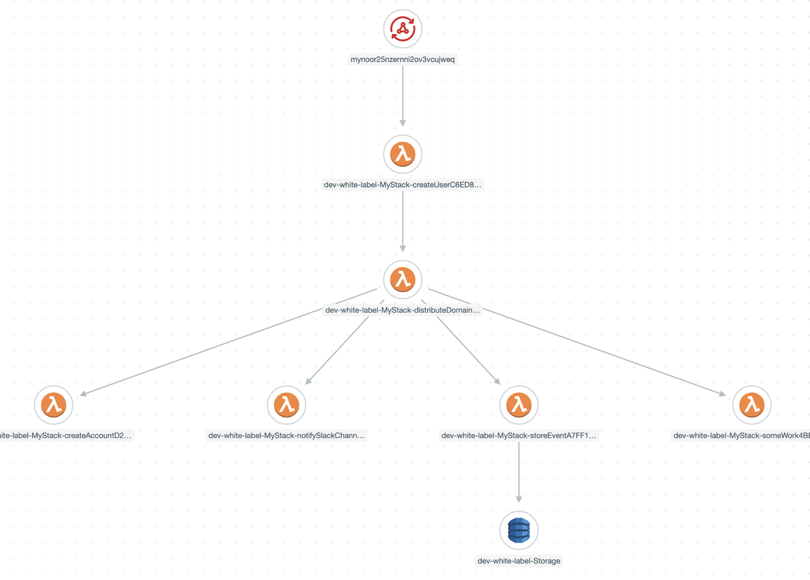

# Serverless Domain-Driven Design (DDD) with unit tests
I took some files from Khalil Stemmler's [white-label](https://github.com/stemmlerjs/white-label) project and made some changes

His project has a nice way to dispatch domain events (`UserCreatedEvent`) after the aggregates changes are persisted and pick them up from the same module (`users/subscribers/AfterUserCreated.ts`) or a different one (`notification/subscribers/AfterUserCreated.ts`).

In the original project, dispatching the event (`DomainEvents.dispatchEventsForAggregate(<user id>)`) is done through Sequelize hooks (`afterCreate`, `afterDestroy`, `afterUpdate`, `afterSave`, `afterUpsert`) while I moved this to the controller, in the case Sequelize isn't being used. As a domain event dispatcher I'm using an intermediate lambda (`DistributeDomainEvents`) which invokes the lambdas (`NotifySlackChannel` and `SomeWork`) that care about a certain domain event (`UserCreatedEvent`). This is the transaction tracing from [Lumigo](https://lumigo.io):

<br />
<p align="center">
    
    <br /><br /><br />
    
</p>
<br />

Also, I made other changes based on [Vladimir Khorikov](https://enterprisecraftsmanship.com) courses where he tackles DDD in a great way.

Unit tests added:
* Value Objects: `User`, `UserEmail`, `UserPassword`, `Alias`
* Use cases/controllers: `CreateUserController` (with faked repo), `NotifySlackChannel`, `SomeWork`
* Domain event registration and dispatching `CreateUserEvents.unit.ts`
* Aggregate `User`

Integration and e2e tests:
* `CreateUserController` (with real repo)

I've used [SST Serverless Stack](https://sst.dev) as it allows debugging lambda code locally while being invoked remotely by resources in AWS.

## Instructions
```
npm i
npm test 
```
