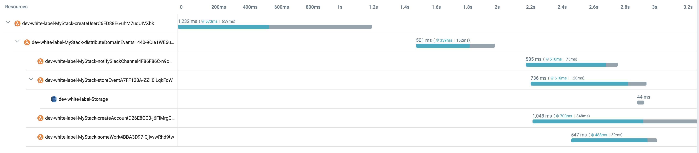

# Serverless Domain-Driven Design (DDD) with unit tests

Domain Events are a fundamental building block in DDD, if you want to indicate an event that is significant to your app, raise this event and let other modules of your app subscribe and react to it.

This project exemplifies a `CreateUser` use case and how we can trigger an event signaling we have a new user onboard.

Domain events (e.g. [UserCreatedEvent](src/modules/users/domain/events/UserCreatedEvent.ts)) are dispatched after the aggregates ([User](src/modules/users/domain/User.ts)) changes are persisted in the database. We can subscribe to it from the same module ([SomeWork](src/modules/users/useCases/someWork/SomeWork.ts)) or a different one ([NotifySlackChannel](src/modules/notification/useCases/notifySlackChannel/NotifySlackChannel.ts)).

Communication in the same module is given as an example but using domain events for intra-module/app communication inside a same domain model may involve adding an indirection that doesn't add value and a direct/explicit flow is more convenient.

The lambda entry point for `CreateUser` use case is [src/modules/users/useCases/createUser/index.ts](src/modules/users/useCases/createUser/index.ts), there we:
* Create [CreateUserController](src/modules/users/useCases/createUser/CreateUserController.ts)
* In `CreateUserController.constructor` we register `UserCreatedEvent` to an intermediate lambda [DistributeDomainEvents](src/shared/infra/dispatchEvents/DistributeDomainEvents.ts) that will invoke all its subscribers (`NotifySlackChannel` and `SomeWork` lambdas).

This is the transaction tracing from [Lumigo](https://lumigo.io):

<br />
<p align="center">
    
</p>
<br />

## Timelines

For the first request all four lambdas have cold start and they take ~2s:

<br />
<p align="center">
    
</p>
<br />

If we repeat a request in the next 5m, we don't have cold starts and they take ~500ms:

<br />
<p align="center">
    
</p>
<br />

## Tests

Unit tests added:

- Value Objects: [UserName](src/modules/users/domain/UserEmail.unit.ts), [UserEmail](src/modules/users/domain/UserEmail.unit.ts), [UserPassword](src/modules/users/domain/UserPassword.unit.ts), [Alias](src/modules/users/domain/Alias.unit.ts)
- Aggregate [User](src/modules/users/domain/User.unit.ts)
- Use cases/controllers: [CreateUserController](src/modules/users/useCases/createUser/CreateUserController.unit.ts) (with faked repo), [NotifySlackChannel](src/modules/notification/useCases/notifySlackChannel/NotifySlackChannel.unit.ts), [SomeWork](src/modules/users/useCases/someWork/SomeWork.unit.ts)

Integration tests:

- Domain event registration and dispatching [CreateUserEvents](src/modules/users/useCases/createUser/CreateUserEvents.int.ts)
- [CreateUserController](src/modules/users/useCases/createUser/CreateUserController.int.ts) (with real repo)

E2E test:

- [CreateUserController](src/modules/users/useCases/createUser/CreateUserController.e2e.ts)

## Stack

* DB: PostgreSQL [CockroachDB](https://www.cockroachlabs.com) Serverless
* ORM: [Sequelize](https://sequelize.org)
* IaC: [SST Serverless Stack](https://sst.dev)
* AWS services: Lambda, API Gateway, Systems Manager Parameter Store 
* Testing: Jest

I've used **SST Serverless Stack** as it allows debugging lambda code locally while being invoked remotely by resources in AWS.

## Credits

I started this project using Khalil Stemmler's [white-label](https://github.com/stemmlerjs/white-label) one, applied some concepts based on [Vladimir Khorikov](https://enterprisecraftsmanship.com) courses where he tackles DDD in a great way and then I turned it into serverless.

## Instructions

```
npm i
npm test
```
